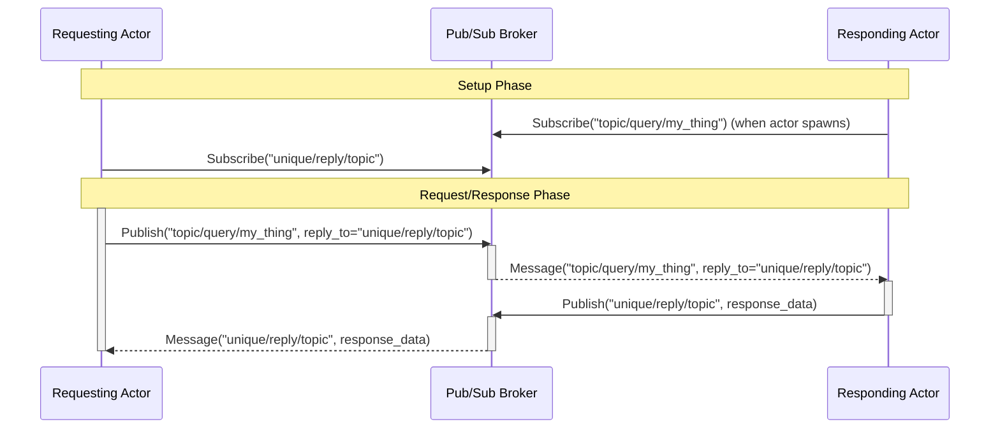
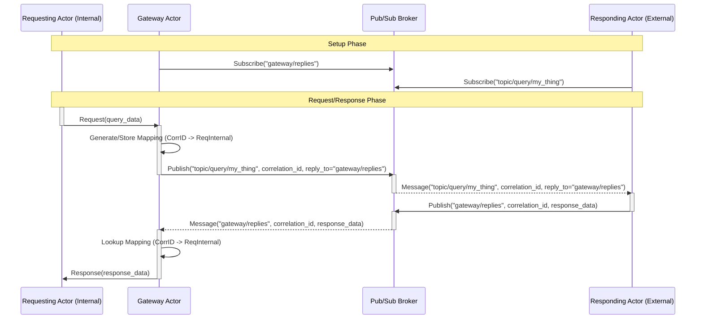

# Request-Response

## Direct-to-target

Here are the steps for implementing a direct-to-target request/response pattern using a Pub/Sub message broker. This involves creating unique custom subscriptions per actor so that the responder knows where to publish their response.

1. **Responding Actor Subscribes**

    The actor designed to respond (the "responder") subscribes to the Pub/Sub broker for a specific query topic, e.g., `topic/query/my_thing`. This tells the broker to forward all messages published to this topic to the responder actor.

2. **Requesting Actor Prepares and Subscribes**

    The actor initiating the request (the "requester") generates a unique reply topic (e.g., based on its own ID and the request ID) and then subscribes to this unique topic with the broker. This ensures the requester will receive messages specifically addressed back to it.

3. **Requesting Actor Publishes Request**

    The requester actor publishes the request message to the responder's query topic (`topic/query/my_thing`). The message payload includes the necessary query data and the unique reply topic generated in step 2 (often in a field like `reply_to`).

4. **Broker Routes Request**

    The Pub/Sub broker receives the message published to `topic/query/my_thing`. Based on the subscription from step 1, the broker routes this message to the responding actor.

5. **Responding Actor Processes and Publishes Response**

    The responder actor receives the request message, processes it, generates a response, and extracts the `reply_to` topic from the incoming message. It then publishes the response message to this extracted `reply_to` topic. The responder does not need to know the identity or `ActorRef` of the requester.

6. **Broker Routes Response**

    The Pub/Sub broker receives the message published to the unique `reply_to` topic. Based on the subscription from step 2, the broker routes this response message to the requesting actor.

7. **Requesting Actor Receives Response**

    The requester actor receives the response message on its unique reply topic.

This pattern effectively decouples the requesting and responding actors, as they only need to know about the Pub/Sub broker and agreed-upon topics, not each other's specific addresses.

## Gateway Correlation ID Mapping

The direct request/response pattern using unique, per-request `reply_to` topics requires each requesting actor to manage its own temporary subscription. This can become cumbersome, especially if the requesting actors are short-lived or if there are a very large number of concurrent requests. An alternative approach leverages a central **Gateway Actor** to manage the response routing using Correlation IDs.

In this pattern:

1. **Gateway Subscription**

    A dedicated **Gateway Actor** maintains a single, long-lived subscription to a fixed `reply_to` topic (e.g., `gateway/replies`). This is the *only* topic     responses are sent to via the broker.

2. **Responder Subscription**

    Responding actors subscribe to their specific query topics with the broker, same as before (e.g., `topic/query/my_thing`).

3. **Request from Internal Actor**

    A requesting actor (behind the Gateway) sends a request message *directly* to the Gateway Actor, including the intended query topic and payload.

4. **Gateway Action - Publish with Correlation ID**

    The Gateway Actor receives the internal request. It generates a unique **Correlation ID** (or reads the one the actor generated) for this request and stores a mapping internally, linking this Correlation ID to the specific requesting actor's `ActorRef`. The Gateway then publishes the request message to the broker using the intended query topic (`topic/query/my_thing`). The crucial difference is that the `reply_to` field in the published message is set to the     *Gateway's* own fixed reply topic (`gateway/replies`), and the message payload includes the generated Correlation ID.

   - *Gateway Map:* `CorrelationID -> RequestingActorRef`
    - *Published Message:* Publish to `topic/query/my_thing` with payload including query data and `correlation_id`, `reply_to: gateway/replies`.

5. **Broker Routes Request**

    The Pub/Sub broker routes the request message to the subscribing responding actor(s) based on the query topic.

6. **Responding Actor Action - Publish Response**

    The responding actor receives the request. It processes it and prepares a response. It takes the `correlation_id` from the incoming message and includes it in the response payload. It then publishes the response message to the topic specified in the `reply_to` field of the incoming message, which is the     Gateway's fixed reply topic (`gateway/replies`).

- *Published Message:* Publish to `gateway/replies` with payload including response data and the *same* `correlation_id`.

7. **Broker Routes Response**

    The Pub/Sub broker routes the response message to the Gateway Actor because the Gateway is subscribed to `gateway/replies`.

8. **Gateway Action - Route to Requester**

    The Gateway Actor receives the response message. It extracts the `correlation_id` from the payload. Using its internal mapping, it looks up the `ActorRef` of the original requesting actor associated with that Correlation ID. It then sends the response message directly to the requesting actor's `ActorRef`. After routing, the Gateway may remove the mapping entry for this Correlation ID (depending on whether duplicate responses are possible).

    - *Action:* Receive message on `gateway/replies`. Extract `correlation_id`. Look up `RequestingActorRef` in internal map. Send response message directly to `RequestingActorRef`.

### Benefits

- **Simplifies Requesting Actors:** Requesting actors no longer need to manage individual subscriptions or unique reply topics. They simply send their request to the well-known Gateway.
- **Better for Short-Lived Actors:** This pattern is ideal when requesting actors are transient, as the long-lived Gateway handles the durable subscription needed to receive the response.
- **Centralized Management:** The complexity of correlating requests and responses is centralized in the Gateway.

### Considerations

- **State Management in Gateway:** The Gateway must reliably store and manage the Correlation ID to `ActorRef` mapping. This requires careful consideration of potential Gateway restarts, memory usage for long-running transactions, and handling potential timeouts or orphaned mappings if a requesting actor dies before receiving a response.
- **Single Point of Failure:** If the Gateway actor fails, all in-flight requests awaiting responses will be lost unless the Gateway's state is persisted and recoverable.

This pattern is particularly useful when you have a boundary (like a Bounded Context boundary managed by the Gateway/Router actor) and many internal actors that need to initiate requests to external services or actors via a Pub/Sub bus without exposing their individual presence or managing complex per-request subscriptions.
